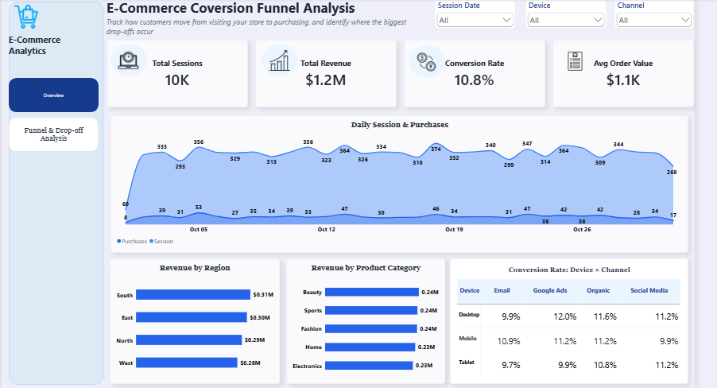
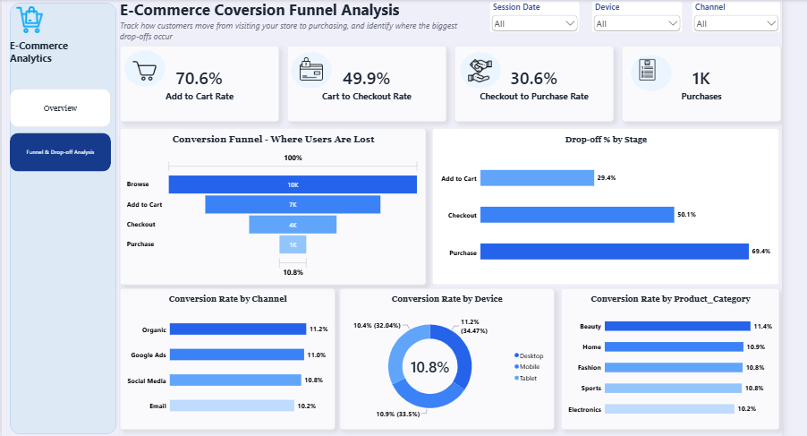

# E-Commerce Conversion Funnel Analysis

**Tools:** Microsoft SQL Server (SSMS) & Power BI Desktop

**Dataset:** `funnel_analysis_data.csv` — 21,663 event rows across 10,000 customer sessions in October 2025

**Author:** Aleemat Agboola


## Project Overview

How many customers visit an online store but never complete a purchase?

That was the main question behind this project.

I was given a raw event log containing customer activity on an e-commerce website. My goal was to turn those individual events into a **conversion funnel** that shows how customers move from browsing to purchasing, identify where the biggest drop-offs occur, determine whether those drop-offs are concentrated among particular customer groups, and recommend practical improvements.

I used **SQL Server** to clean, reshape, and analyze the raw event data, then used **Power BI** to build an interactive dashboard that makes the results easier to explore.

The overall workflow was:

**Raw Event Data → SQL Exploration → Session-Level Funnel → Conversion Analysis → Segment Analysis → Power BI Dashboard → Insights & Recommendations**


# Business Problem

An e-commerce store can have thousands of visitors but still generate relatively few purchases.

The problem is that simply knowing the overall conversion rate does not explain **where customers are leaving the journey**.

A customer might:

* visit the website but never add anything to their cart,
  
* add a product but never begin checkout,
  
* or reach checkout but abandon the purchase before completing payment.

Without identifying the exact stage where customers are dropping off, the business could spend time and money fixing the wrong problem.

For example, improving marketing may bring more visitors to the website, but if most customers are already being lost during checkout, increasing traffic alone may not solve the underlying issue.

This analysis therefore focuses on **understanding the complete customer journey and locating the biggest bottlenecks in the funnel.**


#  What I Wanted to Find Out

The central question was:

> **Out of everyone who visits the store, how many actually make a purchase, and at which stage do most customers drop off?**

To answer that, I needed to:

* Define the funnel stages represented in the data
  
* Measure how many sessions reached each stage
  
* Calculate conversion rates between stages
  
* Identify the largest drop-off
  
* Determine whether the problem was concentrated within a particular device, channel, or region
  
* Understand the revenue generated by these sessions
  
* Translate the findings into practical recommendations
  
* Present the analysis in an interactive Power BI dashboard


#  Business Questions

The analysis was built around six key questions:

1. **What stages make up the customer journey in this dataset?**
   
2. **How many customers make it from one stage to the next?**
   
3. **Where does the biggest drop-off occur?**
   
4. **Does the drop-off vary by device, marketing channel, or region?**
   
5. **How much revenue did these sessions generate, and what was the average order value?**
    
6. **Based on the findings, what improvements should the business consider?**


# Understanding the Data

The dataset, `funnel_analysis_data.csv`, is a raw **event log**.

This means that each row represents an action taken by a customer rather than one row representing an entire customer session.

The dataset contains the following columns:

| Column             | Description                                                            |
| ------------------ | ---------------------------------------------------------------------- |
| `User_ID`          | Identifies the customer                                                |
| `Session_ID`       | Identifies the specific visit/session                                  |
| `Event`            | The action taken during the session                                    |
| `Timestamp`        | When the event occurred                                                |
| `Device`           | Desktop, Mobile, or Tablet                                             |
| `Region`           | North, South, East, or West                                            |
| `Channel`          | How the customer arrived — Organic, Google Ads, Social Media, or Email |
| `Product_Category` | Beauty, Electronics, Fashion, Home, or Sports                          |
| `Revenue`          | Revenue generated; populated on Purchase rows                          |
| `Bounce_Flag`      | Yes/No indicator                                                       |

### An important data observation

The original project brief described the funnel as:

**Visit → Product View → Add to Cart → Purchase**

However, the actual dataset did not contain a distinct **Product View** event. Instead, it contained an additional **Checkout** event.

Therefore, rather than forcing the data into the original brief, I built the funnel around the stages that actually exist in the dataset:

> **Browse → Add to Cart → Checkout → Purchase**

I also found that `Device`, `Region`, `Channel`, and `Product_Category` could change between events within the same session.

To ensure that each session was assigned one consistent value throughout the analysis, I used the values recorded at the session's **first event (Browse)** as the session's representative attributes.


# Loading the Data into SQL Server

Before beginning the analysis, I imported the raw CSV file into SQL Server.

### Steps

1. Opened **SQL Server Management Studio (SSMS)** and connected to a local SQL Server instance.
   
2. Created a database called **`Funnel Analysis`**.
   
3. Used SQL Server's **Import Flat File** wizard to import `funnel_analysis_data.csv`.
   
4. Loaded the data into a table called **`FunnelEvents`**.
   
5. Verified that all records were successfully imported.

### Import validation

```sql
SELECT COUNT(*) AS total_rows
FROM FunnelEvents;

```

The query returned:

**21,663 rows**

This confirmed that the complete dataset had been loaded into SQL Server.


# Exploring the Raw Data

Before transforming the data, I first wanted to understand what was actually inside the event log.

**What events exist?**

> **What events occur in the dataset, and how frequently does each occur?**

```sql
SELECT Event, COUNT(*) AS event_count
FROM FunnelEvents
GROUP BY Event
ORDER BY event_count DESC;

```

### Result

| Event       |  Count |
| ----------- | -----: |
| Browse      | 10,000 |
| Add to Cart |  7,059 |
| Checkout    |  3,524 |
| Purchase    |  1,080 |

This immediately gave me the basic shape of the funnel.


**How many sessions are there?**

> **How many unique customer sessions are represented in the data?**

```sql
SELECT COUNT(DISTINCT Session_ID) AS total_sessions
FROM FunnelEvents;

```

### Result

**10,000 sessions**

The dataset contains 10,000 unique sessions, which also matches the 10,000 Browse events.

This confirms that every session begins with a Browse event.

---

# Reshaping the Data into One Row per Session

This was one of the most important steps in the analysis.

The original event log contains **multiple rows per session** because a customer can perform several actions during one visit.

For example, one session could look like:

```text
Session 1001 → Browse
Session 1001 → Add to Cart
Session 1001 → Checkout
Session 1001 → Purchase
```

To analyze the funnel properly, I needed to transform that into something like:

| Session | Browse | Add to Cart | Checkout | Purchase |
| ------- | -----: | ----------: | -------: | -------: |
| 1001    |      1 |           1 |        1 |        1 |

This gives me **one row per session** and makes it possible to determine how far each customer progressed through the funnel.


> **Which stages did each session reach?**

```sql
SELECT
    Session_ID,
    MAX(CASE WHEN Event = 'Browse' THEN 1 ELSE 0 END) AS reached_browse,
    MAX(CASE WHEN Event = 'Add to Cart' THEN 1 ELSE 0 END) AS reached_cart,
    MAX(CASE WHEN Event = 'Checkout' THEN 1 ELSE 0 END) AS reached_checkout,
    MAX(CASE WHEN Event = 'Purchase' THEN 1 ELSE 0 END) AS reached_purchase
FROM FunnelEvents
GROUP BY Session_ID;

```

For each session, the query checks whether the customer reached each stage.

A value of:

* `1` = the session reached that stage
* `0` = the session did not reach that stage

The resulting dataset contains **10,000 rows — one row for each session.**


# Calculating Funnel Conversion Rates

Once the data was reshaped into session-level records, I could calculate the percentage of sessions that progressed from one stage to the next.

> **Of the customers who reached each stage, what percentage continued to the next one?**

```sql
SELECT
    SUM(reached_browse) AS total_browse,
    SUM(reached_cart) AS total_cart,
    SUM(reached_checkout) AS total_checkout,
    SUM(reached_purchase) AS total_purchase,
    ROUND(100.0 * SUM(reached_cart) / SUM(reached_browse), 1) AS browse_to_cart_pct,
    ROUND(100.0 * SUM(reached_checkout) / SUM(reached_cart), 1) AS cart_to_checkout_pct,
    ROUND(100.0 * SUM(reached_purchase) / SUM(reached_checkout), 1) AS checkout_to_purchase_pct
FROM (
    SELECT
        Session_ID,
        MAX(CASE WHEN Event = 'Browse' THEN 1 ELSE 0 END) AS reached_browse,
        MAX(CASE WHEN Event = 'Add to Cart' THEN 1 ELSE 0 END) AS reached_cart,
        MAX(CASE WHEN Event = 'Checkout' THEN 1 ELSE 0 END) AS reached_checkout,
        MAX(CASE WHEN Event = 'Purchase' THEN 1 ELSE 0 END) AS reached_purchase
    FROM FunnelEvents
    GROUP BY Session_ID
) AS session_funnel;

```

### Results

| Stage Transition               | Conversion Rate | Drop-off |
| ------------------------------ | --------------: | -------: |
| Browse → Add to Cart           |           70.6% |    29.4% |
| Add to Cart → Checkout         |           49.9% |    50.1% |
| Checkout → Purchase            |           30.6% |    69.4% |
| **Overall: Browse → Purchase** |       **10.8%** |        — |

### What this tells us

For every 100 sessions:

* Approximately **71** reach Add to Cart
* Approximately **35** reach Checkout
* Approximately **11** complete a Purchase

The largest loss occurs at the final stage:

> **Checkout → Purchase: 69.4% drop-off**

This became the main area I investigated further.


# Investigating the Drop-off by Customer Segment

Knowing **where** customers are dropping off is only part of the story.

The next question was:

> **Who is experiencing the drop-off?**

I therefore investigated whether checkout-to-purchase conversion differed significantly across:

* Device
  
* Marketing Channel
  
* Region

If one particular group performed dramatically worse than the others, that could point toward a more targeted problem.


## Conversion by Device

> **Does checkout-to-purchase conversion differ by device?**

```sql
WITH session_funnel AS (
    SELECT
        Session_ID,
        MAX(CASE WHEN Event = 'Checkout' THEN 1 ELSE 0 END) AS reached_checkout,
        MAX(CASE WHEN Event = 'Purchase' THEN 1 ELSE 0 END) AS reached_purchase
    FROM FunnelEvents
    GROUP BY Session_ID
),
first_touch AS (
    SELECT
        Session_ID,
        Device
    FROM FunnelEvents fe
    WHERE Timestamp = (
        SELECT MIN(Timestamp) FROM FunnelEvents fe2 WHERE fe2.Session_ID = fe.Session_ID
    )
)
SELECT
    ft.Device,
    SUM(sf.reached_checkout) AS total_checkout,
    SUM(sf.reached_purchase) AS total_purchase,
    ROUND(100.0 * SUM(sf.reached_purchase) / SUM(sf.reached_checkout), 1) AS checkout_to_purchase_pct
FROM session_funnel sf
JOIN first_touch ft ON sf.Session_ID = ft.Session_ID
GROUP BY ft.Device
ORDER BY checkout_to_purchase_pct;

```

I used the same query structure to analyze **Channel** and **Region**, changing only the grouping column.

### Results

| Segment | Results                                                          |       Conversion Range |
| ------- | ---------------------------------------------------------------- | ---------------------: |
| Device  | Tablet 29.3%, Desktop 31.3%, Mobile 31.4%                        |   ~2 percentage points |
| Channel | Email 29.0%, Social Media 30.5%, Organic 31.2%, Google Ads 31.8% | ~2.8 percentage points |
| Region  | West 29.8%, North 30.5%, East 30.5%, South 31.8%                 |   ~2 percentage points |

The conversion rates were relatively close across all three dimensions.

This suggests that the checkout drop-off is **not isolated to one device, channel, or region**. Instead, the pattern appears across the customer base, which makes the checkout experience itself an important area to investigate.


# Creating a Reusable SQL View

Once the analysis was working, I wanted to avoid repeating the same session-level logic every time Power BI needed the data.

I therefore saved the session-level transformation as a reusable SQL view called:

**`vw_SessionFunnel`**

```sql
USE [Funnel Analysis];
GO

CREATE VIEW vw_SessionFunnel AS
WITH first_touch AS (
    SELECT Session_ID, User_ID, Timestamp AS SessionStart,
           Device, Region, Channel, Product_Category
    FROM FunnelEvents
    WHERE Event = 'Browse'
),
outcomes AS (
    SELECT Session_ID,
        MAX(CASE WHEN Event = 'Add to Cart' THEN 1 ELSE 0 END) AS ReachedCart,
        MAX(CASE WHEN Event = 'Checkout'    THEN 1 ELSE 0 END) AS ReachedCheckout,
        MAX(CASE WHEN Event = 'Purchase'    THEN 1 ELSE 0 END) AS ReachedPurchase,
        CAST(SUM(Revenue) AS DECIMAL(12,2)) AS Revenue
    FROM FunnelEvents
    GROUP BY Session_ID
)
SELECT
    f.Session_ID, f.User_ID,
    CAST(f.SessionStart AS date) AS SessionDate,
    f.Device, f.Region, f.Channel, f.Product_Category,
    1 AS ReachedBrowse,
    o.ReachedCart, o.ReachedCheckout, o.ReachedPurchase,
    o.Revenue
FROM first_touch f
JOIN outcomes o ON f.Session_ID = o.Session_ID;
GO

```

This view gives Power BI a clean **one-row-per-session dataset** containing the funnel stages, session attributes, date, and revenue.

### Validating the view

```sql
SELECT COUNT(*) AS total_sessions,
       SUM(Revenue) AS total_revenue,
       SUM(ReachedPurchase) AS purchases
FROM vw_SessionFunnel;

```

The results confirmed:

* **10,000 sessions**
* **1,176,405.78 total revenue**
* **1,080 purchases**

These matched the results from the earlier analysis.


# Building the Power BI Dashboard

With the SQL analysis complete, I connected **Power BI Desktop** directly to `vw_SessionFunnel` using **Import mode**.

I loaded the view as a table named:

**`Sessions`**

I also created a small manually entered table called:

**`Stages`**

This table contains the four funnel stages in their correct order:

1. Browse
   
2. Add to Cart
   
3. Checkout
   
4. Purchase

The `Stages` table was then used to drive the funnel visual and display the correct metric for each stage.


# Power BI Measures

The following DAX measures were created to power the dashboard.

## Session Counts

```text
Sessions = SUM(Sessions[ReachedBrowse])
Cart Sessions = SUM(Sessions[ReachedCart])
Checkout Sessions = SUM(Sessions[ReachedCheckout])
Purchases = SUM(Sessions[ReachedPurchase])

```

These measures count how many sessions reached each stage.


## Conversion Rates

```text
Add to Cart Rate = DIVIDE([Cart Sessions], [Sessions])
Cart to Checkout Rate = DIVIDE([Checkout Sessions], [Cart Sessions])
Checkout to Purchase Rate = DIVIDE([Purchases], [Checkout Sessions])
Overall Conversion Rate = DIVIDE([Purchases], [Sessions])

```

These measures calculate the conversion rate between each stage.


## Revenue Metrics

```text
Total Revenue = SUM(Sessions[Revenue])
Avg Order Value = DIVIDE([Total Revenue], [Purchases])

```

These measures provide the revenue and average order value used throughout the dashboard.


## Driving the Funnel Visual

I used the `Stages` table to dynamically return the appropriate session count for each funnel stage:

```text
Funnel Sessions =
SWITCH(
    SELECTEDVALUE(Stages[Stage]),
    "Browse", [Sessions],
    "Add to Cart", [Cart Sessions],
    "Checkout", [Checkout Sessions],
    "Purchase", [Purchases]
)

```

I then created a measure for the conversion percentage from the previous stage:

```text
% of Previous Stage =
SWITCH(
    SELECTEDVALUE(Stages[Stage]),
    "Browse", 1,
    "Add to Cart", [Add to Cart Rate],
    "Checkout", [Cart to Checkout Rate],
    "Purchase", [Checkout to Purchase Rate]
)

```


## Calculating Drop-off

The drop-off percentage is simply the portion that did **not** continue to the next stage:

```text
Drop-off % =
1 - [% of Previous Stage]

```

I also created a text measure to display the drop-off with a downward arrow:

```text
Stage Drop-off =
VAR DropOff = [Drop-off %]
RETURN
IF(DropOff = 0, FORMAT(DropOff, "0.0%"), "↓ " & FORMAT(DropOff, "0.0%"))

```

Finally, I created a color measure so the drop-off could be displayed in red:

```text
Stage Drop-off Color =
VAR DropOff = [Drop-off %]
RETURN
IF(DropOff = 0, "#000000", "#EF4444")

```


# 14. Dashboard Design

The Power BI report was organized into separate pages so that each page answers a different part of the business problem.

## Page 1 — Overview

The Overview page provides a high-level summary of the e-commerce performance.

It includes:

* Total Sessions
  
* Total Revenue
  
* Overall Conversion Rate
  
* Average Order Value
  
* Daily sessions and purchases throughout October
  
* Revenue by Region
  
* Revenue by Product Category
  
* Device-by-Channel conversion analysis

The purpose of this page is to give users a quick understanding of the overall performance before moving into the detailed funnel analysis.




## Page 2 — Funnel & Drop-off Analysis

This page focuses specifically on the customer journey.

It includes:

* Stage-to-stage conversion KPIs
  
* The main conversion funnel
  
* Drop-off percentage by stage
  
* Conversion by Device
  
* Conversion by Channel
  
* Conversion by Product Category

The main purpose of this page is to make the **checkout bottleneck** immediately visible and allow users to investigate whether the problem changes across different customer segments.




## Interactive Filtering

Both pages share the same:

* Date
  
* Device
  
* Channel

filters.

This means users can select a specific period, device, or acquisition channel and see the relevant dashboard visuals update accordingly.


# Key Findings

The analysis produced five major findings.

### 1. Overall conversion is 10.8%

Only **10.8% of all sessions result in a purchase**.

In simple terms, for every 100 sessions that begin with a Browse event, approximately 11 end in a purchase.


### 2. Checkout → Purchase is the largest bottleneck

The biggest drop-off occurs between **Checkout and Purchase**.

Only **30.6%** of sessions that reach checkout go on to complete a purchase.

That represents a **69.4% drop-off** at the final stage.


### 3. Add to Cart → Checkout is the second-largest leak

Of the customers who add something to their cart, only **49.9%** continue to checkout.

This means **50.1%** of cart sessions are lost before checkout even begins.


### 4. The checkout problem appears across customer segments

Device, Channel, and Region show relatively similar checkout-to-purchase conversion rates.

The differences are only around **2–3 percentage points** across the groups analyzed.

This suggests that the issue is not obviously concentrated within one device, marketing channel, or region. Instead, the checkout experience itself is an area that deserves attention.


### 5. The sessions generated significant revenue

Across the month:

* **Total Revenue:** 1,176,405.78
  
* **Purchases:** 1,080
  
* **Average Order Value:** approximately $1,089

This shows that even relatively small improvements in the conversion funnel could potentially have a meaningful impact on revenue.


# Recommendations

The findings point toward four areas the business could investigate.

### 1. Simplify the checkout experience

The largest loss occurs between Checkout and Purchase.

The business should review:

* The number of checkout steps
  
* Whether guest checkout is available
  
* Payment-related friction
  
* Form complexity
  
* Error messages
  
* Points where customers abandon the process

The goal would be to identify exactly what is preventing customers from completing an order after they have already reached checkout.


### 2. Make the final cost clearer earlier

Unexpected costs can cause customers to abandon a purchase late in the journey.

The business could consider displaying estimated:

* Shipping costs
  
* Taxes
  
* Fees
  
* Final order totals

earlier in the customer journey so customers know what to expect before reaching the final payment step.


### 3. Address cart abandonment

Half of the customers who add an item to their cart do not proceed to checkout.

A possible response would be to test:

* Cart-reminder emails
  
* Free-shipping thresholds
  
* Limited incentives
  
* Cart recovery campaigns

These should be tested and measured to determine whether they actually improve the Add to Cart → Checkout transition.


### 4. Focus the initial fix on the checkout experience

The analysis does not show a large difference in checkout-to-purchase conversion across device, channel, or region.

Therefore, rather than immediately creating separate fixes for individual audience groups, the first investigation should focus on the **common checkout experience shared by customers**.


# Final Takeaway

The analysis tells a fairly clear story:

**10,000 sessions entered the funnel → 7,059 added to cart → 3,524 reached checkout → 1,080 completed a purchase.**

The biggest point of friction occurs at the final step:

> **Checkout → Purchase: 69.4% drop-off**

Because this pattern is relatively consistent across device, channel, and region, the data points toward the checkout journey as the first area the business should investigate.

The purpose of the Power BI dashboard is therefore not just to display these numbers, but to make the customer journey, bottlenecks, and segment patterns easy to explore interactively.


# Project Files

* **Power BI Report:** [Download Funnel Analysis.pbix](Funnel%20Analysis.pbix)
  
*Every figure in this project came directly from the SQL queries and Power BI measures shown above, using `funnel_analysis_data.csv` as the source dataset.*
